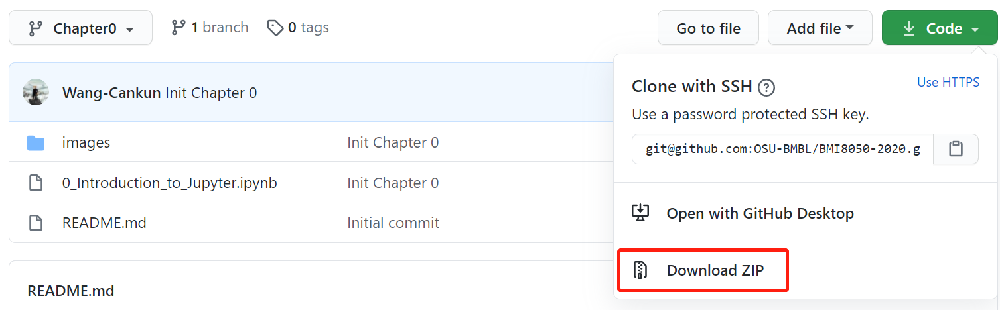
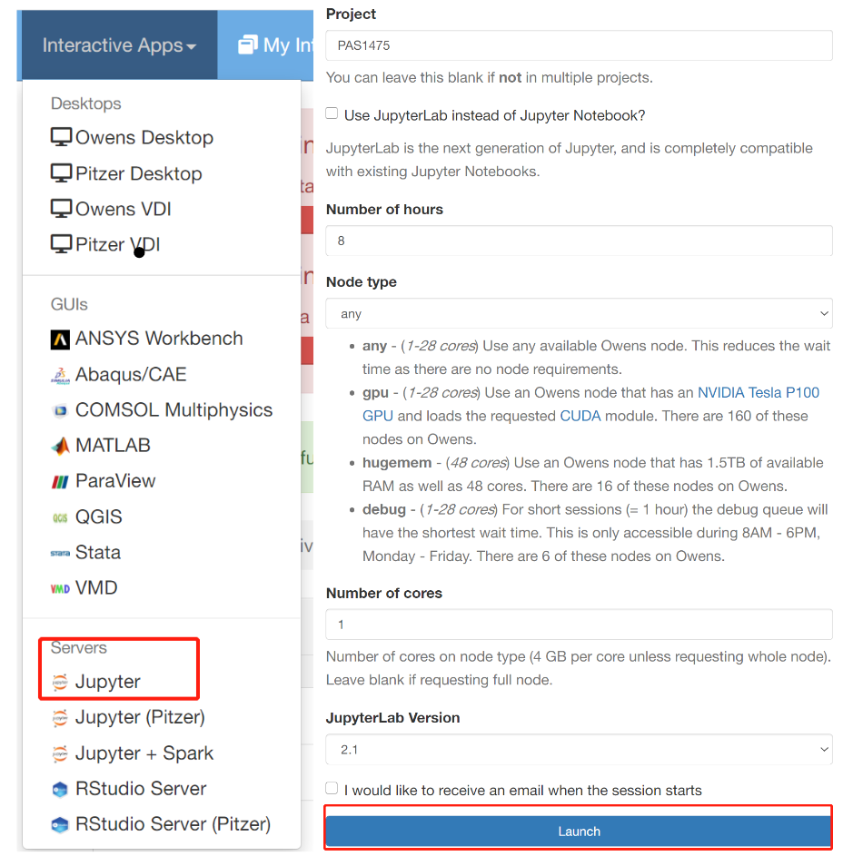

# BMI8050-2020

This is the repository for the **Applications of Machine Learning and Artificial Intelligence in Biomedical Informatics** (BMI8050 on Autumn 2020), organized by Cankun Wang.

## Table of contents

- Guest - Predictive modeling using R markdown.
- Chapter 1 - Introduction to Jupyter Notebooks: The entirety of every chapter of is available as an interactive Jupyter Notebook. Since the most important thing for learning deep learning is writing code and experimenting, it's important that you have a great platform for experimenting with code.
- Chapter 2 - Mechanisms of Action (MoA) Prediction using DNN models.
- Chapter 3 - DCNet - A simple LSTM-RNN for generating sequence consensus.
- Chapter 4 - A tutorial of DNA motif finding using CNN.

## Installation
To download all course material, type the following into the command-line:

```
git clone git@github.com:OSU-BMBL/BMI8050-2020.git
```
Or simply download an archived course contents:



Launch Jupyter server on OSC:




To update the repository and keep the modified files:

```
git stash && git pull && git checkout stash -- .
```

## About

Author: [Cankun Wang](https://github.com/Wang-Cankun)

Repository material is inspired by the following courses:

- [fastbook](https://github.com/fastai/fastbook) by [fastai](https://docs.fast.ai/)
- [Neural Networks and Deep Learning
](https://www.coursera.org/learn/neural-networks-deep-learning) by Andrew Ng